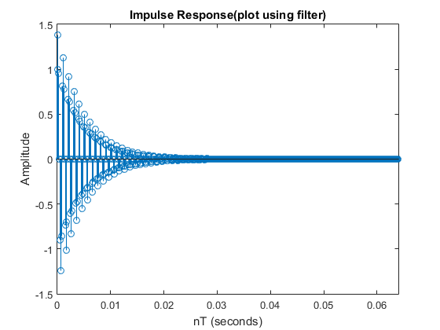
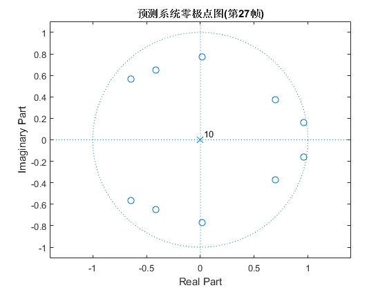
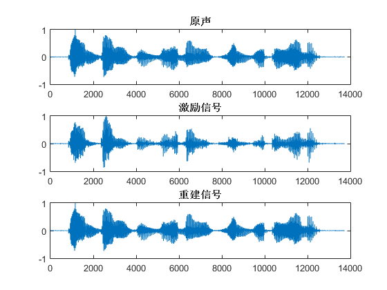
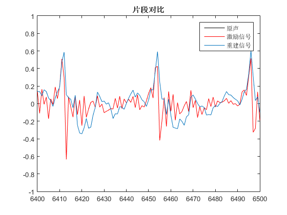

# speech-synthesizer
Homework No.2 for summer course: MATLAB

## 语音预测模型

1. 给定 $$e(n)=s(n)-a_1s(n-1)-a_2s(n-2)$$

    1. 假设$e(n)$是输入信号, $s(n)$是输出信号, 则上述滤波器的传递函数为 $$H(z)=\frac{z^2}{z^2-a_1z-a_2}$$

    2. 如果$a_1=1.3789, a_2=-0.9506$, 则利用`[Z,P,K]=tf2zp(b,a)`或`roots(poly)`等函数可求出系统极点为 $$p_{1,2}=0.6895\pm 0.6894j=0.9750e^{\pm j0.7854}$$

        根据共振峰频率的定义 $$f=\frac{\omega}{2\pi}=\frac{\Omega}{2\pi T}=\frac{\Omega f_s}{2\pi}=\frac{Arg(p)}{2\pi}f_s$$

        取$f_s=8000\text{Hz}$, 求得**共振峰频率**(Formant Frequency) $f_f=999.94\text{Hz}$

    3. 绘制**零极点图**, `zplane(Z,P)`

        

    4. 绘制**频率响应**, `freqz(b,a,512,fs)`

        

        从频率响应图中也可直观地看出**共振峰频率**在1000Hz附近

    5. 绘制**单位样值响应**

        * `impz(b,a,512,fs)`

            

        * `filter`

            ```matlab
            x = zeros(1,512);
            x(1) = 1;
            y = filter(b,a,x);
            stem(0:1/fs:511/fs,y);
            ```

            

            **与impz画出的结果相同**

2. 阅读`speechproc.m`

    ```matlab
    function speechproc()

        % 定义常数
        FL = 80;                % 帧长
        WL = 240;               % 窗长
        P = 10;                 % 预测系数个数
        s = readspeech('voice.pcm',100000);             % 载入语音s
        L = length(s);          % 读入语音长度
        FN = floor(L/FL)-2;     % 计算帧数
        % 预测和重建滤波器
        exc = zeros(L,1);       % 激励信号（预测误差）
        zi_pre = zeros(P,1);    % 预测滤波器的状态
        s_rec = zeros(L,1);     % 重建语音
        zi_rec = zeros(P,1);
        % 合成滤波器
        exc_syn = zeros(L,1);   % 合成的激励信号（脉冲串）
        s_syn = zeros(L,1);     % 合成语音
        % 变调不变速滤波器
        exc_syn_t = zeros(L,1);   % 合成的激励信号（脉冲串）
        s_syn_t = zeros(L,1);     % 合成语音
        % 变速不变调滤波器（假设速度减慢一倍）
        exc_syn_v = zeros(2*L,1);   % 合成的激励信号（脉冲串）
        s_syn_v = zeros(2*L,1);     % 合成语音

        hw = hamming(WL);       % 汉明窗
        
        % 依次处理每帧语音
        for n = 3:FN

            % 计算预测系数（不需要掌握）
            s_w = s(n*FL-WL+1:n*FL).*hw;    %汉明窗加权后的语音
            [A E] = lpc(s_w, P);            %用线性预测法计算P个预测系数
                                            % A是预测系数，E会被用来计算合成激励的能量

            if n == 27
            % (3) 在此位置写程序，观察预测系统的零极点图
                
            end
            
            s_f = s((n-1)*FL+1:n*FL);       % 本帧语音，下面就要对它做处理

            % (4) 在此位置写程序，用filter函数s_f计算激励，注意保持滤波器状态

            
            % exc((n-1)*FL+1:n*FL) = ... 将你计算得到的激励写在这里

            % (5) 在此位置写程序，用filter函数和exc重建语音，注意保持滤波器状态

            
            % s_rec((n-1)*FL+1:n*FL) = ... 将你计算得到的重建语音写在这里

            % 注意下面只有在得到exc后才会计算正确
            s_Pitch = exc(n*FL-222:n*FL);
            PT = findpitch(s_Pitch);    % 计算基音周期PT（不要求掌握）
            G = sqrt(E*PT);           % 计算合成激励的能量G（不要求掌握）

            
            % (10) 在此位置写程序，生成合成激励，并用激励和filter函数产生合成语音

            
            % exc_syn((n-1)*FL+1:n*FL) = ... 将你计算得到的合成激励写在这里
            % s_syn((n-1)*FL+1:n*FL) = ...   将你计算得到的合成语音写在这里

            % (11) 不改变基音周期和预测系数，将合成激励的长度增加一倍，再作为filter
            % 的输入得到新的合成语音，听一听是不是速度变慢了，但音调没有变。

            
            % exc_syn_v((n-1)*FL_v+1:n*FL_v) = ... 将你计算得到的加长合成激励写在这里
            % s_syn_v((n-1)*FL_v+1:n*FL_v) = ...   将你计算得到的加长合成语音写在这里
            
            % (13) 将基音周期减小一半，将共振峰频率增加150Hz，重新合成语音，听听是啥感受～

            
            % exc_syn_t((n-1)*FL+1:n*FL) = ... 将你计算得到的变调合成激励写在这里
            % s_syn_t((n-1)*FL+1:n*FL) = ...   将你计算得到的变调合成语音写在这里
            
        end

        % (6) 在此位置写程序，听一听 s ，exc 和 s_rec 有何区别，解释这种区别
        % 后面听语音的题目也都可以在这里写，不再做特别注明
        

        % 保存所有文件
        writespeech('exc.pcm',exc);
        writespeech('rec.pcm',s_rec);
        writespeech('exc_syn.pcm',exc_syn);
        writespeech('syn.pcm',s_syn);
        writespeech('exc_syn_t.pcm',exc_syn_t);
        writespeech('syn_t.pcm',s_syn_t);
        writespeech('exc_syn_v.pcm',exc_syn_v);
        writespeech('syn_v.pcm',s_syn_v);
    return

    % 从PCM文件中读入语音
    function s = readspeech(filename, L)
        fid = fopen(filename, 'r');
        s = fread(fid, L, 'int16');
        fclose(fid);
    return

    % 写语音到PCM文件中
    function writespeech(filename,s)
        fid = fopen(filename,'w');
        fwrite(fid, s, 'int16');
        fclose(fid);
    return

    % 计算一段语音的基音周期，不要求掌握
    function PT = findpitch(s)
    [B, A] = butter(5, 700/4000);
    s = filter(B,A,s);
    R = zeros(143,1);
    for k=1:143
        R(k) = s(144:223)'*s(144-k:223-k);
    end
    [R1,T1] = max(R(80:143));
    T1 = T1 + 79;
    R1 = R1/(norm(s(144-T1:223-T1))+1);
    [R2,T2] = max(R(40:79));
    T2 = T2 + 39;
    R2 = R2/(norm(s(144-T2:223-T2))+1);
    [R3,T3] = max(R(20:39));
    T3 = T3 + 19;
    R3 = R3/(norm(s(144-T3:223-T3))+1);
    Top = T1;
    Rop = R1;
    if R2 >= 0.85*Rop
        Rop = R2;
        Top = T2;
    end
    if R3 > 0.85*Rop
        Rop = R3;
        Top = T3;
    end
    PT = Top;
    return
    ```

3. 在`speechproc`运行至第27帧时观察预测系统的**零极点图**

    **预测系统** $$e(n)=s(n)-\sum_{k=1}^{N}a_k s(n-k)$$

    其中$s(n)$为输入, $e(n)$为输出, 则系统函数 $$H_{pre}(z)=\frac{z^N-\sum_{k=1}^{N}a_k z^{N-k}}{z^N}$$

    取**预测系数个数** $N=P=10$

    在`speechproc`中相应位置插入代码:

    ```matlab
    if n == 27
    % (3) 在此位置写程序，观察预测系统的零极点图
        [z,p,~] = tf2zp(A,[1,zeros(1,P)]);
        zplane(z,p);
        title('预测系统零极点图(第27帧)');
    end
    ```

    

4. 在循环中添加程序: 对每帧语音信号$s(n)$和预测模型系数$\{a_i\}$, 用`filter`计算激励信号$e(n)$. **注意: 在系数变化的情况下连续滤波, 需维持滤波器的状态不变**

    ```matlab
    % (4) 在此位置写程序，用filter函数s_f计算激励，注意保持滤波器状态
    [Y,zi_pre] = filter(A,[1,zeros(1,P)],s_f,zi_pre);   % keep state: zi_pre
    exc((n-1)*FL+1:n*FL) = Y;
    % exc((n-1)*FL+1:n*FL) = ... 将你计算得到的激励写在这里
    ```

5. 完善`speechproc.m`程序, 在循环中添加程序: 用你计算得到的激励信号$e(n)$和预测模型系数$\{a_i\}$, 用`filter`计算重建语音$\hat{s}(n)$. **同样要注意维持滤波器的状态不变**

    对于**语音重建模型** $$\hat{s}(n)=x(n)+\sum_{k=1}^{N}a_k \hat{s}(n-k)$$

    输入为$x(n)$, 输出为$\hat{s}(n)$, 则系统函数 $$H_{rec}(z)=\frac{1}{H_{pre}(z)}=\frac{z^N}{z^N-\sum_{k=1}^{N}a_k z^{N-k}}$$

    ```matlab
    % (5) 在此位置写程序，用filter函数和exc重建语音，注意保持滤波器状态
    [Y,zi_rec] = filter([1,zeros(1,P)],A,Y,zi_rec);
    s_rec((n-1)*FL+1:n*FL) = Y;
    % s_rec((n-1)*FL+1:n*FL) = ... 将你计算得到的重建语音写在这里
    ```

6. 对比$e(n)$, $s(n)$以及$\hat{s}(n)$信号

    ```matlab
    sound([s;exc;s_rec],8000);
    figure(2);
    subplot(3,1,1);plot(s);title('原声');
    subplot(3,1,2);plot(exc);title('激励信号');axis([0 14000 -5e4 5e4]);
    subplot(3,1,3);plot(s_rec);title('重建信号');
    figure(3);
    plot(s,'k');axis([6400 6500 -2e4 2e4]);hold on
    plot(exc,'r');
    plot(s_rec);hold off;
    legend('原声','激励信号','重建信号');title('片段对比');
    ```

    **听觉感受**

    * $s(n)$和$\hat{s}(n)$听不出区别

    * $e(n)$杂音更大, 被淹没在噪声中; 若没有对语音内容的**先验知识**, 很难分辨出语音的内容

    **整体波形**

    

    * 激励信号$e(n)$整体幅度小于$s(n)$和$\hat{s}(n)$

    * $s(n)$和$\hat{s}(n)$波形包络基本一致, $e(n)$则不同

    * 三者波形包络基本可以反映音节出现的位置

    **局部波形**

    

    * $s(n)$和$\hat{s}(n)$波形完全重合(黑色的$s(n)$被蓝色的$\hat{s}(n)$覆盖)

    * $e(n)$变化更陡峭剧烈, 而$s(n)$和$\hat{s}(n)$的变化相对缓慢

    * $e(n)$的局部峰值基本对应$s(n)$和$\hat{s}(n)$的局部峰值
